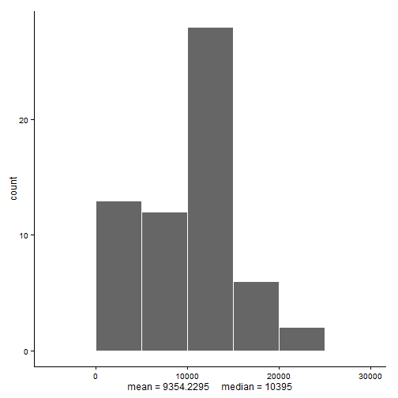
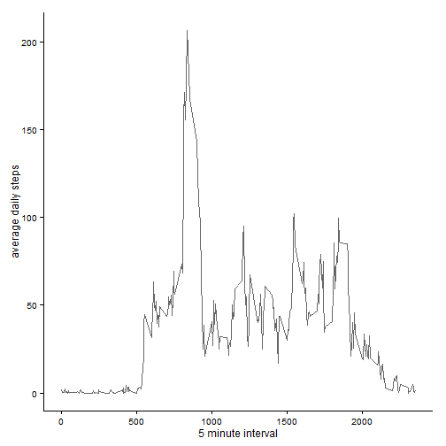
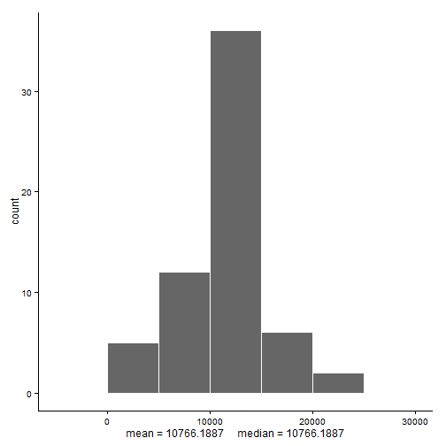
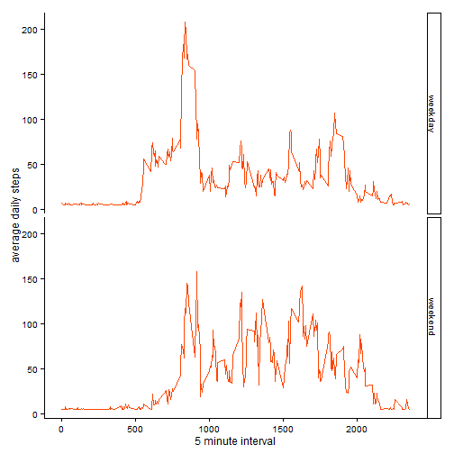

```r
# will use the following libs.
require("readr")
require("dplyr")
require("ggplot2")
require("mice")
require("lubridate")
```
## Loading and preprocessing the data

```r
unzip("activity.zip")
# will use library readr
activity <- read_csv("activity.csv", col_names = TRUE, col_types = list(
        steps = col_integer(),
        date = col_date(),
        interval = col_integer()
))
```


## What is mean total number of steps taken per day?

```r
#calculate number of steps per day
howmany <-activity %>% 
        group_by(date) %>% 
        summarize(sumsteps=sum(steps, na.rm=TRUE))
# calculate mean and median total number of steps
stepsstats <- howmany %>% 
        summarize(themean = round(mean(sumsteps),4), themedian=median(sumsteps))

# make histogram
ggplot(data=howmany, aes(x=sumsteps))+
        geom_histogram(colour="white", fill="gray40", binwidth=5000)+
        xlab(paste("mean =", stepsstats$themean, 
                   "    median =", stepsstats$themedian, sep=" " ))+
        theme_classic()
```

 

#### As shown in this histogram, the mean total number of steps per day is 9354.2295, with a median of 10395 . Since the mean is less than the median, our sample is left skewed.


## What is the average daily activity pattern?

```r
pattern <- activity %>% 
        group_by(interval) %>% 
        summarize(avgdaily = mean(steps, na.rm=TRUE))

ggplot(data = pattern, aes(x=interval, y=avgdaily))+
        geom_line(colour ="gray40" )+
        labs(x="5 minute interval", y="average daily steps")+
        theme_classic()
```

 

```r
## Get interval with max avg steps
themaxinterval <- pattern$interval[which.max(pattern$avgdaily)]
```
#### In this activity pattern, the maximum avergage steps accross all days is reached at the 835 interval (5 minute).


## Imputing missing values

```r
#Calculate and report the total number of missing values in the dataset 
#(i.e. the total number of rows with NAs)
nacount <- table(is.na(activity)==TRUE)[[2]]
```
#### This dataset contains 2304 missing values (NAs) for steps column. This is 0.1311475 percent of the observatons. 


```r
#Fill missing values in dataset
## Strategy for NAs:
# Will use librery mice as the strategy to fill in missing values. Method will be mean.
## firsth copy the df 
dummy <- activity
# change the date column to char
dummy$date <- as.character.Date(dummy$date)
## use mice library for imputation 
set.seed(20140418)
imputed <- complete(mice(dummy, method=c("mean", "", ""), print=FALSE))
#calculate number of steps per day with new df without NAs
howmanynow <-imputed %>% 
        group_by(date) %>% 
        summarize(sumstepsnow=sum(steps, na.rm=TRUE))
# calculate mean and median total number of steps
stepsstatsnow <- howmanynow %>% 
        summarize(themeannow = round(mean(sumstepsnow),4),
                  themediannow=round(median(sumstepsnow),4))

# make histogram
ggplot(data=howmanynow, aes(x=sumstepsnow))+
        geom_histogram(colour="white", fill="gray40", binwidth=5000)+
        xlab(paste("mean =", stepsstatsnow$themeannow,
                   "    median =", stepsstatsnow$themediannow, sep=" " ))+
        theme_classic()
```

 

#### By filling the missing values, we can now see a difference in the histogram, the mean total number of steps per day is 1.0766189 &times; 10<sup>4</sup>, with a median of 1.0766189 &times; 10<sup>4</sup> . Since the mean and the median are now the same, our sample apears normal. This tells us that missing values can result in missleading estimates and by imputing them we can lessen the impact.


## Are there differences in activity patterns between weekdays and weekends?

```r
# Create a new factor variable in the dataset with two levels – “weekday” and “weekend”
#indicating whether a given date is a weekday or weekend day.
imputed$weekdayfactor <- as.factor(ifelse(wday(ymd(imputed$date))>1 & 
        wday(ymd(imputed$date))<7,"weekday", "weekend" ))

patternnow <- imputed %>% 
        group_by(weekdayfactor, interval) %>% 
        summarize(avgdailynow = mean(steps, na.rm=TRUE))

ggplot(data = patternnow, aes(x=interval, y=avgdailynow))+
        geom_line(colour ="orangered" )+
        labs(x="5 minute interval", y="average daily steps")+
        theme_classic()+
        facet_grid(weekdayfactor~.)
```

 


